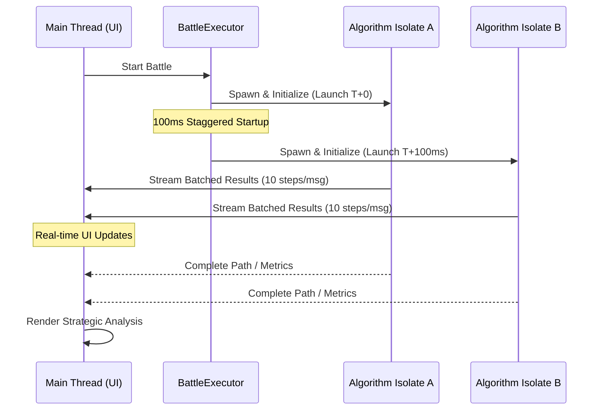

# Algorithm Arena: High-Performance AI Visualizer 🚀

Algorithm Arena is an elite, high-performance visualization engine for AI search algorithms. Built with Flutter, it provides a premium environment for exploring, benchmarking, and understanding pathfinding, state-space search, and constraint satisfaction problems.

[](https://flutter.dev)
[](https://dart.dev)
[](https://github.com/Rinav01/ai_algo)

---

## 💎 Premium Features

### 1. Interactive Pathfinding Laboratory
- **Dynamic Grid Interface**: Hand-paint obstacles or move start/goal markers in real-time.
- **Procedural Generation**: Deploy **Recursive Division** or **Randomized Prim's** to generate complex topological challenges.
- **Metric Dashboard**: High-fidelity tracking of explored nodes, path optimality, and execution latency.

### 2. Multi-Threaded Algorithm Battles ⚔️
Compare two algorithms side-by-side using a specialized multi-isolate execution engine.
- **Zero-Lag Parallelism**: Competing search processes run in separate background isolates to keep the UI at a buttery 60 FPS.
- **Strategic Analysis Reports**: Post-battle insights powered by a structured analysis engine that evaluates efficiency, heuristic quality, and node-reduction percentages.
- **Batched Streaming**: Real-time progress visualization using a high-frequency batched messaging protocol.

### 3. State-Space & Puzzle Solvers
Dive into classic AI challenges with specialized visualizers:
- **8-Puzzle**: Optimized A* solver using Manhattan distance heuristics.
- **N-Queens**: Recursive backtracking visualizer demonstrating constraint satisfaction.

---

## 🏗 Technical Architecture

### Isolate Threading Model
The core of the Arena is built for high-performance stability. Searches are offloaded to background isolates to prevent main-thread congestion (ANR).



### Stability Engineering (Performance Guardrails)
- **Staggered Startup**: Initiates algorithm isolates with a 100ms offset to distribute the CPU/Memory peak during initialization.
- **Isolate Hardening**: Passes minimal String-based IDs and lightweight snapshots instead of complex objects to ensure thread-safety and zero serialization errors.
- **Batch Messaging**: Compresses 10+ search steps into a single message to minimize the overhead of main-thread message handling.

---

## 🛠 Tech Stack & Conventions

### Core Technologies
- **Logic**: Dart 3.x
- **UI Framework**: Flutter (Latest Stable)
- **State**: [Riverpod](https://riverpod.dev) for deterministic state management.
- **Animations**: [flutter_animate](https://pub.dev/packages/flutter_animate) for staggered glassmorphic effects.
- **Adaptive UI**: `flutter_screenutil` for multi-form-factor compatibility.

### Coding Standards
- **Unified Imports**: All internal files **must** use package-relative imports (`package:ai_algo_app/`). Avoid generic relative imports to prevent library duplication and type-mismatch errors.
- **Stateless Adaptors**: Algorithms must implement the `SearchAlgorithm` interface and remain stateless to ensure they can be executed symmetrically across isolates.

---

## 🚀 Development Guide

### Prerequisites
- Flutter SDK (Latest Stable)
- Android Studio / VS Code with Dart & Flutter extensions.

### Installation & Launch
1. **Prepare Environment**:
   ```bash
   git clone https://github.com/Rinav01/ai_algo_arena.git
   cd ai_algo_arena
   flutter pub get
   ```
2. **Launch Debug Session**:
   ```bash
   flutter run
   ```

### Adding a New Algorithm
1. Implement your search logic in `lib/core/search_algorithms.dart` by extending `SearchAlgorithm`.
2. Register the new algorithm in the `AlgorithmExecutor` factory method inside `lib/services/algorithm_executor.dart`.
3. Add the algorithm to the `ControlPanel` selection list.

---

## 📜 License & Acknowledgments
Distributed under the MIT License. See `LICENSE` for more information.

Developed with ❤️ by [Rinav](https://github.com/Rinav01)
