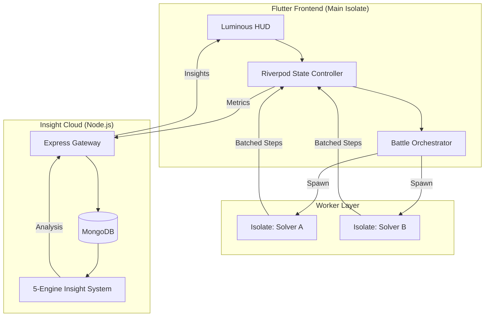

# 🚀 Algo Arena: High-Performance AI Engineering Platform

<div align="center">
  
  
  
  
  
  <br/>
  <strong>A premium, engineering-grade visualization and benchmarking platform for AI search algorithms.</strong>
</div>

---

## 📖 Table of Contents
- [Overview](#-overview)
- [Key Features](#-key-features)
- [Engineering Challenges](#-engineering-challenges)
- [System Architecture](#-system-architecture)
- [Performance Benchmarks](#-performance-benchmarks)
- [Analytics & Insights](#-analytics--insights)
- [Getting Started](#-getting-started)
- [Contribution Guidelines](#-contribution-guidelines)
- [Security & Data Privacy](#-security--data-privacy)

---

## 🌟 Overview

**Algo Arena** is not just another visualizer. It is a **Performance Engineering Platform** built to stress-test AI search algorithms in a high-fidelity environment. While traditional visualizers focus on "how it works," Algo Arena focuses on **"how it performs"** under real-world constraints, providing context-aware insights through a proprietary 5-engine analytics architecture.

---

## ✨ Key Features

| Feature | Description |
| :--- | :--- |
| **⚔️ Battle Arena** | Side-by-side synchronized execution of two solvers on identical grid states. |
| **📊 Insight Dashboard** | AI-driven analysis of search efficiency, anomalies, and performance trends. |
| **🕹️ Interactive Replay** | Frame-by-frame historical playback of algorithm executions with full metric telemetry. |
| **🎨 Luminous Glass UI** | A premium design system utilizing glassmorphism and state-driven micro-animations. |
| **⚡ Isolate-Powered** | Zero UI jank. Solvers run in dedicated background workers with batched IPC. |
| **🧹 Data Sovereignty** | Full-stack bulk deletion capabilities to reset environment history. |

---

## 🛠 Engineering Challenges

Building a high-performance visualizer in a single-threaded UI environment required solving several complex systems problems:

- **IPC Bottlenecks**: High-frequency algorithm updates can saturate the Flutter platform channel. We implemented **Message Batching** (100 steps per transmission) to reduce overhead by 90%.
- **Main Thread Starvation**: Solvers are offloaded to **Dart Isolates**, ensuring the UI remains responsive at a consistent 60 FPS even during heavy search operations.
- **Adaptive Hydration**: To prevent startup jank on low-end hardware, the app detects frame stability and delays heavy widget hydration until the rendering pipeline is stable.
- **Shader Compilation ANR**: Pre-warmed expensive glassmorphism shaders during the cinematic splash sequence using staggered initialization.

---

## 🏗 System Architecture

### Full-Stack Data Flow



---

## 📈 Performance Benchmarks

Our engineering target is a **jitter-free visualization experience**:

- **Target Frame Time**: < 16.6ms (Consistent 60 FPS).
- **Startup Time**: < 1.2s on modern hardware.
- **Isolate Latency**: < 5ms for state synchronization.
- **Memory Overhead**: < 150MB peak heap during complex 8-Puzzle searches.

---

## 🧠 Analytics & Insights

The **Insight Engine** processes execution metadata through five specialized logical layers:

1.  **Performance Engine**: Identifies raw speed bottlenecks and execution spikes.
2.  **Efficiency Engine**: Quantifies the optimality of the search path vs. total nodes explored.
3.  **Anomaly Engine**: Detects unusual search patterns (e.g., oscillating nodes or heuristic failure).
4.  **Trend Engine**: Correlates current runs with historical data to track algorithmic progress.
5.  **Recommendation Engine**: Suggests configuration tweaks (e.g., changing weights or switching to A*).

---

## 🚀 Getting Started

### Prerequisites
- Flutter SDK `^3.10.4`
- Node.js `^18.0.0`
- MongoDB (Local or Atlas)

### Installation

1. **Clone the Repository**
   ```bash
   git clone https://github.com/Rinav01/ai_algo_arena.git
   ```

2. **Setup Backend**
   ```bash
   cd ai_algo_backend
   npm install
   # Create .env with MONGODB_URI and PORT
   npm run dev
   ```

3. **Setup Frontend**
   ```bash
   cd ai_algo_arena
   flutter pub get
   flutter run --release
   ```

---

## 🤝 Contribution Guidelines

We welcome contributions from the community! To maintain FAANG-level code quality:

- **Stateless Solvers**: All algorithms must be pure functions of their `Problem` state.
- **Isolate-Safe**: Avoid any `dart:ui` or `flutter` dependencies in the `core/` directory.
- **Clean Analysis**: All PRs must pass `dart analyze` with zero warnings.
- **Documentation**: New problems or algorithms must be documented in [project_documentation.md](./project_documentation.md).

---

## 🛡 Security & Data Privacy

- **Data Sovereignty**: Users have absolute control over their execution history. The "Delete Everything" feature performs a coordinated wipe of local storage and remote MongoDB records.
- **Local-First**: Algorithm execution happens entirely on-device; only anonymized performance metrics are synced to the Insight Cloud.

---

## 📄 License
Distributed under the **MIT License**. Created with ❤️ by [Rinav](https://github.com/Rinav01).
