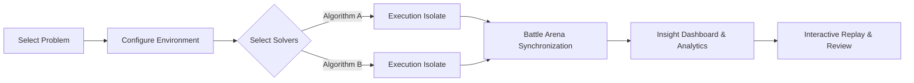
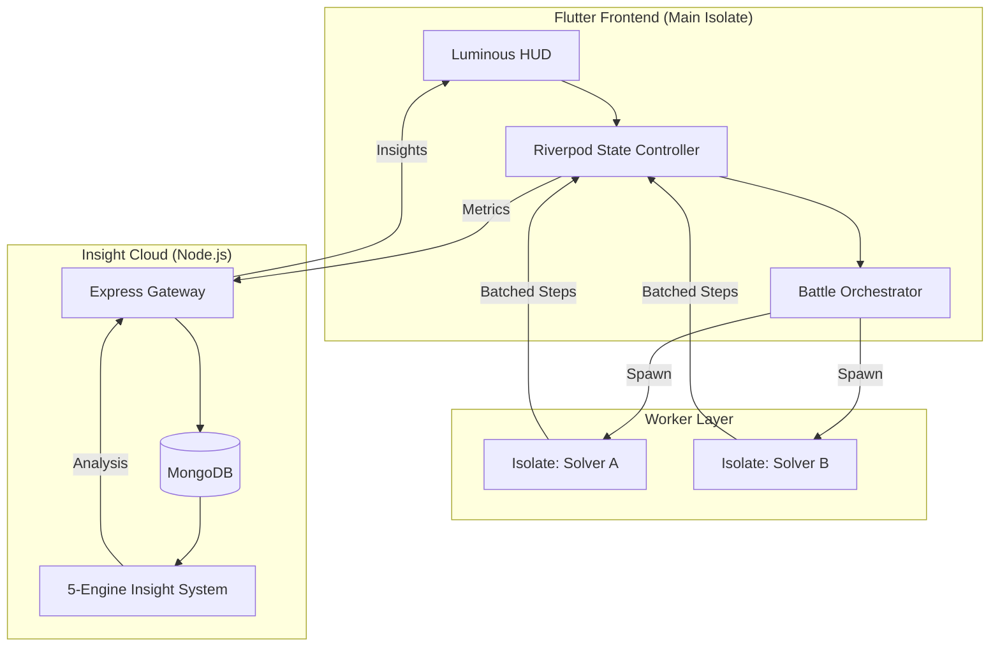
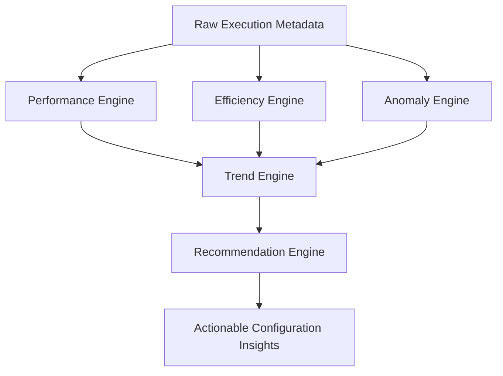

# 🚀 Algo Arena: High-Performance AI Engineering Platform

<div align="center">


<br/>
<strong>A premium, engineering-grade visualization and benchmarking platform for AI search algorithms.</strong>
</div>

---

## 📖 Table of Contents
- [Overview](#-overview)
- [Key Features](#-key-features)
- [Engineering Challenges](#-engineering-challenges)
- [System Architecture](#-system-architecture)
- [Performance Benchmarks](#-performance-benchmarks)
- [Analytics & Insights](#-analytics--insights)
- [Getting Started](#-getting-started)
- [Contribution Guidelines](#-contribution-guidelines)
- [Security & Data Privacy](#-security--data-privacy)

---

## 🌟 Overview

**Algo Arena** is not just another visualizer. It is a **Performance Engineering Platform** built to stress-test AI search algorithms in a high-fidelity environment. While traditional visualizers focus on "how it works," Algo Arena focuses on **"how it performs"** under real-world constraints, providing context-aware insights through a proprietary 5-engine analytics architecture.

### User Journey Flow



---

## ✨ Key Features

| Feature | Description |
| :--- | :--- |
| **⚔️ Battle Arena** | Side-by-side synchronized execution of two solvers on identical grid states. |
| **📊 Insight Dashboard** | AI-driven analysis of search efficiency, anomalies, and performance trends. |
| **🕹️ Interactive Replay** | Frame-by-frame historical playback of algorithm executions with full metric telemetry. |
| **🎨 Luminous Glass UI** | A premium design system utilizing glassmorphism and state-driven micro-animations. |
| **⚡ Isolate-Powered** | Zero UI jank. Solvers run in dedicated background workers with batched IPC. |
| **🧹 Data Sovereignty** | Full-stack bulk deletion capabilities to reset environment history. |

---

## 🛠 Engineering Challenges

Building a high-performance visualizer in a single-threaded UI environment required solving several complex systems problems:

| Challenge | Impact | Engineering Solution |
| :--- | :--- | :--- |
| **IPC Bottlenecks** | Saturated Flutter platform channel | **Message Batching** (100 steps/transmission) reduces overhead by 90% |
| **Main Thread Starvation** | UI unresponsiveness & dropped frames | Solvers offloaded to **Dart Isolates** for consistent 60 FPS |
| **Adaptive Hydration** | Startup jank on low-end hardware | Delayed widget hydration based on frame stability detection |
| **Shader Compilation ANR** | Jitter during initial render | Pre-warmed glassmorphism shaders via staggered initialization in splash |

---

## 🏗 System Architecture

### Full-Stack Data Flow



---

## 📈 Performance Benchmarks

Our engineering target is a **jitter-free visualization experience**:

| Metric | Target / Benchmark | Condition |
| :--- | :--- | :--- |
| **Frame Time** | `< 16.6ms` | Consistent 60 FPS rendering |
| **Startup Time** | `< 1.2s` | Modern hardware |
| **Isolate Latency**| `< 5ms` | Cross-isolate state synchronization |
| **Memory Overhead**| `< 150MB` | Peak heap during complex 8-Puzzle searches |

---

## 🧠 Analytics & Insights

The **Insight Engine** processes execution metadata through five specialized logical layers:



| Layer | Engine Name | Responsibility |
| :---: | :--- | :--- |
| 1 | **Performance Engine** | Identifies raw speed bottlenecks and execution spikes. |
| 2 | **Efficiency Engine** | Quantifies search path optimality vs. total nodes explored. |
| 3 | **Anomaly Engine** | Detects unusual search patterns (oscillating nodes, heuristic failure). |
| 4 | **Trend Engine** | Correlates current runs with historical data to track progress. |
| 5 | **Recommendation Engine**| Suggests configuration tweaks (changing weights, switching algorithms). |

---

## 🚀 Getting Started

### Prerequisites

| Component | Requirement |
| :--- | :--- |
| **Flutter SDK** | `^3.10.4` |
| **Node.js** | `^18.0.0` |
| **Database** | MongoDB (Local or Atlas) |

### Installation

1. **Clone the Repository**
```bash
git clone https://github.com/Rinav01/ai_algo_arena.git
```

2. **Setup Backend**
```bash
cd ai_algo_backend
npm install
# Create .env with MONGODB_URI and PORT
npm run dev
```

3. **Setup Frontend**
```bash
cd ai_algo_arena
flutter pub get
flutter run --release
```

---

## 🤝 Contribution Guidelines

We welcome contributions from the community! To maintain FAANG-level code quality:

| Guideline | Rule / Requirement |
| :--- | :--- |
| **Stateless Solvers** | All algorithms must be pure functions of their `Problem` state. |
| **Isolate-Safe** | Avoid any `dart:ui` or `flutter` dependencies in the `core/` directory. |
| **Clean Analysis** | All PRs must pass `dart analyze` with zero warnings. |
| **Documentation** | New problems/algorithms must be documented in [project_documentation.md](./project_documentation.md). |

---

## 🛡 Security & Data Privacy

| Principle | Implementation Details |
| :--- | :--- |
| **Data Sovereignty**| Absolute control over execution history. "Delete Everything" coordinates wiping local storage & remote MongoDB. |
| **Local-First** | Algorithm execution is on-device; only anonymized performance metrics sync to Insight Cloud. |

---

## 📄 License
Distributed under the **MIT License**. Created with ❤️ by [Rinav](https://github.com/Rinav01).
