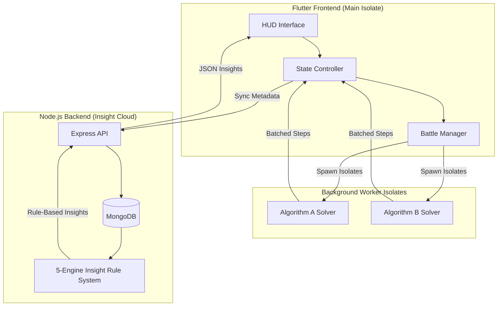

# 🌌 Algo Arena: High-Performance AI Visualizer

[](https://flutter.dev)
[](https://dart.dev)
[](https://nodejs.org/)
[](https://www.mongodb.com/)
[](https://opensource.org/licenses/MIT)

**Algo Arena** is a premium, engineering-grade visualization platform for AI search algorithms. It transforms raw performance metrics into human-readable, context-aware insights using a sophisticated **5-Engine Analytics Architecture**.

---

## ❓ Why Algo Arena?

Most algorithm visualizers focus solely on education and lack real-world benchmarking capabilities. They show *how* an algorithm works, but not *how well* it performs under stress.

**Algo Arena bridges that gap** by acting as a:
- 🔬 **Performance Lab**: Stress-test algorithms on complex, user-defined topologies.
- 📊 **Analytics Platform**: Quantify search behavior with multi-dimensional metrics.
- ⚙️ **Engineering Tool**: Analyze optimization trade-offs (e.g., Heuristic weight vs. Search time).

---

## 🧩 Engineering Challenges Solved

Building a high-performance visualizer in a single-threaded UI environment presented significant hurdles:

- 🚫 **UI Lag during High-Frequency Updates**: Solved via **Message Batching** (100 steps/msg) and **Isolate Staggering** to prevent CPU spikes.
- 🔁 **Heavy Computation Blocking Main Thread**: Offloaded all pathfinding solvers to background **Dart Isolates**, maintaining a consistent 60 FPS.
- 📉 **Noisy Analytics Data**: Designed a **Rule-Based Insight Filtering System** to extract high-signal trends from thousands of raw data points.
- 🧠 **Comparison Complexity**: Designed a **Synchronized Battle Execution Engine** that ensures two independent solvers run on identical grid states with zero cross-talk.

---

## 🏗️ System Architecture

### Full System Data Flow


---

## 📊 Intelligent Analytics & Benchmark Mode

### ⚔️ Benchmark Mode (Algorithm Battle)
Run two algorithms in parallel to compare efficiency in real-time. The system ensures:
- **Identical Initial State**: Same grid, start/end points, and weights.
- **Isolated Execution**: No resource contention between solvers.
- **Synchronized Playback**: View step-by-step progress side-by-side.

### 📈 Metrics Tracked
Every run is quantified using the following engineering metrics:
- **Nodes Explored**: Total search space visited.
- **Path Length**: Optimality of the final solution.
- **Execution Time (ms)**: Pure solver duration excluding UI overhead.
- **Memory Usage**: Isolate heap allocation during search.
- **Efficiency Ratio**: Path Nodes / Explored Nodes.
- **Heuristic Accuracy**: How closely the heuristic guided the search to the path.

---

## 🌐 API Contract (Insight Cloud)

Algo Arena integrates with a cloud-based analytics engine to provide longitudinal trend analysis.

### `POST /api/v1/runs`
Uploads execution metadata for analysis.
```json
{
  "algorithm": "A*",
  "nodesExplored": 1240,
  "pathLength": 82,
  "gridDensity": 0.45
}
```

### `GET /api/v1/insights`
Returns generated insights from the 5-Engine Rule System.
```json
{
  "insights": [
    {
      "type": "performance",
      "severity": "high",
      "message": "A* outperformed BFS by 72% on this high-density grid.",
      "confidence": 0.94
    }
  ]
}
```

---

## 🆚 How This Stands Out

| Feature | Algo Arena | Typical Visualizers |
| :--- | :---: | :---: |
| **Real-time Analytics** | ✅ | ❌ |
| **Algorithm Benchmarking** | ✅ | ❌ |
| **Isolate-Based Execution** | ✅ | ❌ |
| **Insight Generation** | ✅ | ❌ |
| **Replay System** | ✅ | ⚠️ Limited |

---

## 📂 Project Structure
```

📱 Frontend (Flutter)

lib/
├── core/                       # Foundation & Architectures
│   ├── algorithm_adaptor.dart  # Bridges problems to solvers
│   ├── app_theme.dart          # Luminous Glass design system
│   ├── eightpuzzle_problem.dart# 8-Puzzle state logic
│   ├── grid_problem.dart       # Pathfinding logic
│   ├── nqueens_problem.dart    # N-Queens constraints logic
│   ├── problem_definition.dart # Abstract Problem/Solver base
│   └── search_algorithms.dart   # Core BFS, DFS, A*, Dijkstra logic
├── models/                     # Data Structures
│   ├── algo_info.dart          # Algorithm metadata model
│   ├── analytics_models.dart   # High-fidelity Insight & Stat models
│   ├── app_settings.dart       # User preferences model
│   └── grid_node.dart          # Cell properties & types
├── painters/                   # Custom Graphics
│   └── grid_painter.dart       # High-performance grid renderer
├── screens/                    # High-Level UI Pages
│   ├── algorithm_battle_screen.dart # Benchmarking arena
│   ├── analytics_screen.dart   # Insight dashboard & charts
│   ├── eightpuzzle_visualizer_screen.dart
│   ├── history_screen.dart     # Past run logs
│   ├── home_screen.dart        # Entry hub
│   ├── interactive_problem_screen.dart
│   ├── maze_editor_screen.dart  # Arena Architect editor
│   ├── nqueens_visualizer_screen.dart
│   ├── pathfinding_visualizer_screen.dart
│   ├── replay_screen.dart      # Granular historical run playback
│   ├── settings_screen.dart    # Global configurations
│   ├── splash_screen.dart      # Cinematic entry sequence
│   └── visualizer_base_mixin.dart
├── services/                   # Business Logic
│   ├── algorithm_executor.dart # Multi-isolate orchestrator
│   ├── algorithm_recommender.dart # Contextual suggestion engine
│   ├── api_service.dart        # Backend cloud integration
│   ├── battle_analyzer.dart    # Post-run metrics processor
│   ├── map_persistence.dart    # JSON serialization
│   ├── maze_generator.dart     # Procedural map generation
│   ├── nqueens_solver.dart     # Backtracking implementation
│   ├── run_optimizer.dart      # Logic for efficient execution
│   └── stats_service.dart      # Metric aggregation
├── state/                      # State Management (Riverpod)
│   ├── analytics_provider.dart # Insight filtering & sorting
│   ├── grid_controller.dart    # Grid manipulation manager
│   ├── replay_provider.dart    # Playback state control
│   └── settings_provider.dart  # Persistence provider
├── widgets/                    # UI Components
│   ├── analytics/              # Specialized insight/chart widgets
│   │   ├── analytics_filters.dart
│   │   ├── analytics_skeleton.dart
│   │   ├── complexity_tab_widgets.dart
│   │   ├── distribution_chart.dart
│   │   ├── insight_card.dart
│   │   ├── summary_chart.dart
│   │   ├── trends_chart.dart
│   │   └── versus_tab_widgets.dart
│   ├── algorithm_info_sheet.dart
│   ├── algorithm_recommendation_card.dart
│   ├── algorithm_tabs.dart
│   ├── algo_info_modal.dart
│   ├── animated_number_display.dart
│   ├── battle_results_panel.dart
│   ├── bottom_nav_bar.dart
│   ├── concept_visualizer.dart
│   ├── control_panel.dart
│   ├── grid_visualizer_canvas.dart
│   ├── replay_controls.dart
│   ├── stat_card.dart
│   ├── trend_line.dart
│   └── visualizer_widgets.dart
└── main.dart                   # App entry point

---

## 🔌 Extensibility
Designed for growth, Algo Arena supports easy extensions:
- **New Algorithms**: Implement `problem_definition.dart` to add any search solver.
- **New Analytics Rules**: Plug additional logic into the 5-Engine Backend.
- **GPU Acceleration**: Built-in support for moving grid logic to shaders in the future.

---

## 🛣️ Roadmap
- [ ] **Web Version**: High-performance Flutter Web support.
- [ ] **Multi-Agent Simulation**: Visualizing concurrent agent pathfinding.
- [ ] **AI-Based Learning**: Automated heuristic tuning based on grid data.
- [ ] **Real-Time Collaboration**: Shared grid sessions via WebSockets.

---

## 🚀 Deployment & Takeaways

### Deployment Notes
- **Frontend**: Flutter (Profile/Release mode optimized for Skia/Impeller).
- **Backend**: Node.js Express (Stateless, scalable analytics pipeline).
- **Database**: MongoDB Atlas (Time-series optimization for run data).

### 🏁 Key Takeaways
Algo Arena is not just a visualizer—it is a **Performance Engineering Platform**. It showcases:
- **Advanced State Management**: Leveraging Riverpod for decoupled UI/Logic.
- **Systems Thinking**: Designing multi-process data flows via Isolates.
- **Data Engineering**: Transforming raw metrics into actionable engineering insights.

---

## 🚀 Getting Started

### Installation
```bash
git clone https://github.com/Rinav01/ai_algo_arena.git
cd ai_algo_arena
flutter pub get
flutter run --release
```

---

## 📜 License
Distributed under the **MIT License**. Created with ❤️ by [Rinav](https://github.com/Rinav01).
