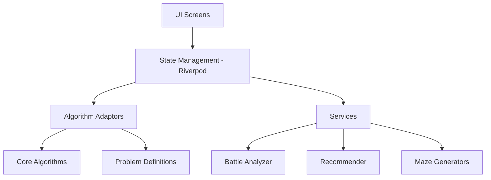

# AI Algo Visualizer 🚀

A comprehensive AI search algorithm visualizer built with Flutter. This application allows users to interactively explore, compare, and understand various search algorithms across different problem domains like pathfinding, puzzles, and constraint satisfaction.


---

## 🌟 Features

### 1. Pathfinding Visualization
Visualize how different algorithms find their way through a grid-based map.
- **Interactive Grid**: Draw walls, move start and goal nodes, and adjust grid size (Small, Medium, Large).
- **Procedural Maze Generation**: Generate complex mazes using **Recursive Division** or **Randomized Prim's Algorithm**.
- **Real-time Metrics**: Track explored nodes, path length, and execution time.

### 2. Algorithm Battle Mode ⚔️
Compare two algorithms side-by-side on the same problem.
- **Synchronized Execution**: Watch algorithms compete in real-time.
- **Detailed Comparison**: Automated analysis of efficiency, optimality, and speed.
- **Victory Reports**: Comprehensive reports explaining why one algorithm outperformed another.

### 3. State-Space Search Visualizers
Explore classic AI problems beyond simple pathfinding:
- **8-Puzzle Solver**: Watch A* or BFS solve the sliding tile puzzle using Manhattan distance heuristics.
- **N-Queens Problem**: Visualize the backtracking algorithm as it attempts to place $N$ queens on a board without conflict.

### 4. Intelligent Algorithm Recommender 🧠
Not sure which algorithm to use? The built-in recommender analyzes your grid's complexity and recommends the best fit based on:
- Grid Size
- Obstacle Density
- Search requirements (Optimality vs. Speed)

---

## 🛠 Supported Algorithms

| Category | Algorithm | Guaranteed Shortest Path? | Use Case |
| :--- | :--- | :---: | :--- |
| **Uninformed** | **BFS** (Breadth-First Search) | ✅ Yes | Uniform cost grids, finding shortest path. |
| **Uninformed** | **DFS** (Depth-First Search) | ❌ No | Memory-efficient exploration (though not for shortest path). |
| **Weighted** | **Dijkstra's** | ✅ Yes | Grids with variable movement costs. |
| **Informed** | **A* Search** | ✅ Yes | Most efficient pathfinding with heuristic guidance. |
| **Informed** | **Greedy Best-First** | ❌ No | Fast exploration, prioritizes speed over optimality. |

---

## 🏗 Architecture

The project follows a modular architecture, separating logic, state, and UI.



### Key Modules:
- **`lib/core`**: The engine of the app. Contains abstract `Problem` definitions and generic `SearchAlgorithm` implementations.
- **`lib/state`**: Centralized state management using Riverpod to handle grid updates, algorithm execution, and UI sync.
- **`lib/services`**: High-level logic for maze generation, performance analysis, and algorithmic recommendations.
- **`lib/screens`**: Responsive UI layers for different visualization modes.

---

## 💻 Tech Stack

- **Framework**: [Flutter](https://flutter.dev)
- **State Management**: [Riverpod](https://riverpod.dev)
- **Animations**: [flutter_animate](https://pub.dev/packages/flutter_animate)
- **Charts**: [fl_chart](https://pub.dev/packages/fl_chart)
- **Styling**: [Google Fonts](https://pub.dev/packages/google_fonts) & Custom Theme System
- **Responsive Design**: `responsive_builder` & `flutter_screenutil`

---

## 🚀 Getting Started

### Prerequisites
- Flutter SDK (latest stable version)
- Dart SDK

### Installation

1. **Clone the repository**
   ```bash
   git clone https://github.com/yourusername/ai_algo.git
   cd ai_algo
   ```

2. **Install dependencies**
   ```bash
   flutter pub get
   ```

3. **Run the application**
   ```bash
   flutter run
   ```

---

## 🗺 Roadmap

- [ ] **Weighted Grids**: Add support for terrain costs (swamp, forest, etc.).
- [ ] **More Algorithms**: Implement Bellman-Ford and Bidirectional Search.
- [ ] **Custom Heuristics**: Allow users to choose between Manhattan, Euclidean, and Chebyshev distances.
- [ ] **Export/Import**: Save custom grid layouts as JSON files.
- [ ] **Step-by-Step Debugger**: A "debug" mode to step through algorithms node-by-node with local variable inspection.

---

## 📜 License

This project is licensed under the MIT License - see the [LICENSE](LICENSE) file for details.

---
Developed with ❤️ by [Rinav/Rinav01]
