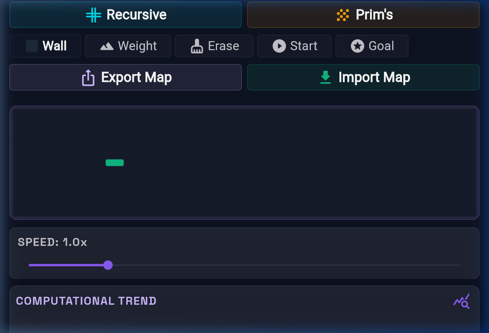
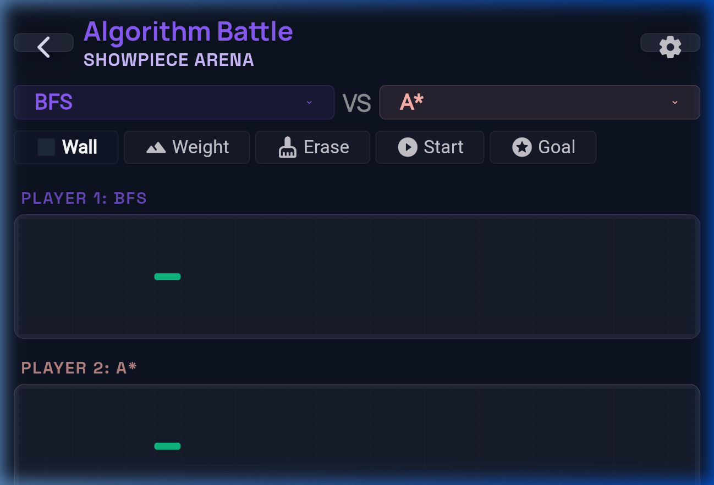
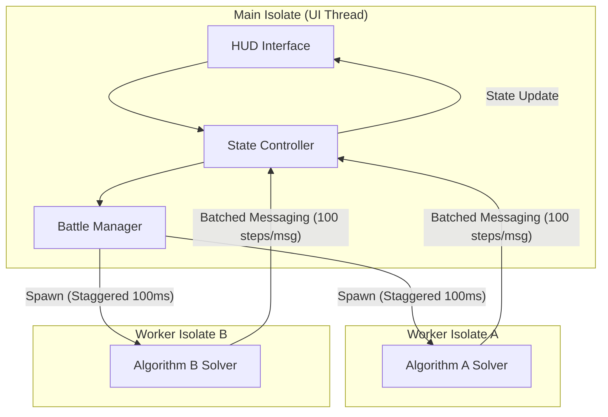

# 🌌 Algo Arena: High-Performance AI Visualizer

[](https://flutter.dev)
[](https://dart.dev)
[](https://opensource.org/licenses/MIT)
[]()

**Algo Arena** is a premium, engineering-grade visualization platform for AI search algorithms. Built with a focus on high-fidelity performance analysis, it enables real-time benchmarking, interactive pathfinding exploration, and side-by-side algorithm "battles" using a multi-isolate background execution engine.

---

## 🎬 Cinematic Preview

<p align="center">
  
  
</p>

---

## 🧠 Algorithm Intelligence Matrix

| Algorithm | Type | Heuristic? | Weighted? | Guarantees Shortest? | Time Complexity |
| :--- | :--- | :---: | :---: | :---: | :--- |
| **A* Search** | Informed | Yes | Yes | Yes (if admissible) | $O(E)$ |
| **Dijkstra** | Uninformed | No | Yes | Yes | $O(E + V \log V)$ |
| **BFS** | Uninformed | No | No | Yes (unweighted) | $O(V + E)$ |
| **DFS** | Uninformed | No | No | No | $O(V + E)$ |
| **Greedy BFS** | Informed | Yes | Yes | No | $O(b^m)$ |
| **8-Puzzle (A*)** | State-Space | Yes | N/A | Yes | $O(states)$ |
| **N-Queens** | Backtracking | N/A | N/A | Yes (all solutions) | $O(n!)$ |

---

## 🏗️ Architectural Blueprint

### Multi-Isolate Execution Model
The core engine offloads heavy search logic to background **Worker Isolates**. This ensures the Main UI thread remains at a consistent **60 FPS** even during dual-algorithm battles.



---

## 📂 Codebase Anatomy

A detailed map of the project's architecture and file responsibilities. For a more exhaustive technical report, see the [Project Guide](file:///d:/Flutter%20Projects/Personal/ai_algo/PROJECT_GUIDE.md).

### 📁 core/ (Logic & Definitions)
- **[problem_definition.dart](file:///d:/Flutter%20Projects/Personal/ai_algo/lib/core/problem_definition.dart)**: Abstract foundation for all Problems and Search Algorithms.
- **[search_algorithms.dart](file:///d:/Flutter%20Projects/Personal/ai_algo/lib/core/search_algorithms.dart)**: Pure Dart implementations of BFS, DFS, Dijkstra, A*, and Greedy BFS.
- **[grid_problem.dart](file:///d:/Flutter%20Projects/Personal/ai_algo/lib/core/grid_problem.dart)**: Maps 2D grid logic to the abstract problem-solving domain.

### 📁 services/ (Business Logic)
- **[algorithm_executor.dart](file:///d:/Flutter%20Projects/Personal/ai_algo/lib/services/algorithm_executor.dart)**: Orchestrates asynchronous, step-by-step solver progression.
- **[algorithm_recommender.dart](file:///d:/Flutter%20Projects/Personal/ai_algo/lib/services/algorithm_recommender.dart)**: Suggests the optimal algorithm based on map complexity and density.
- **[maze_generator.dart](file:///d:/Flutter%20Projects/Personal/ai_algo/lib/services/maze_generator.dart)**: Procedural generation using Prim's and Recursive Division.

### 📁 state/ (State Management)
- **[grid_controller.dart](file:///d:/Flutter%20Projects/Personal/ai_algo/lib/state/grid_controller.dart)**: Central manager for grid manipulations and user interactions.
- **[settings_provider.dart](file:///d:/Flutter%20Projects/Personal/ai_algo/lib/state/settings_provider.dart)**: Riverpod provider for managing global app configurations.

### 📁 widgets/ (UI Components)
- **[grid_visualizer_canvas.dart](file:///d:/Flutter%20Projects/Personal/ai_algo/lib/widgets/grid_visualizer_canvas.dart)**: Interactive canvas hosting the high-performance grid painter.
- **[battle_results_panel.dart](file:///d:/Flutter%20Projects/Personal/ai_algo/lib/widgets/battle_results_panel.dart)**: Benchmarking overlay for side-by-side performance comparison.


---

## ⚔️ Battle Arena Mechanics

The Battle Arena is not just a visualizer; it's a benchmarking suite. Each battle generates a **Strategic Analysis Report** based on real-time execution metrics.

### Performance Indicators

| Metric | Calculation | Impact |
| :--- | :--- | :--- |
| **Efficiency Score** | $PathNodes / ExploredNodes$ | Higher means the algorithm was more directed. |
| **Redundancy %** | $(TotalNodes - PathNodes) / TotalNodes$ | Measures how much "useless" work was done. |
| **Victory Margin** | $\Delta ExploredNodes / MaxExplored$ | The percentage by which the winner outperformed the loser. |
| **Speed per Node** | $Time(ms) / ExploredNodes$ | Efficiency of the solver implementation itself. |

---

## 🎨 Design System: "The Neural Nexus"

The UI follows a strict **Glassmorphism** design language tailored for high-performance mobile and desktop environments.

| Token | Value / Hex | Usage |
| :--- | :--- | :--- |
| **Accent (Violet)** | `#8B5CF6` | Primary CTAs, Active States, Queue Markers |
| **Path (Cyan)** | `#00DBE9` | Final Paths, "Lit" indicators |
| **Surface Low** | `#161B2B` | Dialog Backgrounds, Modals |
| **Opti-Glass** | `Opacity: 0.88` | High-performance glass without BackdropBlur |
| **Typography** | `Space Grotesk` | High-tech headings and technical labels |
| **Typography** | `Manrope` | Readable body text and performance metrics |

---

## ⚡ Engineering Optimization Portfolio

To achieve buttery-smooth performance, the following technical guardrails are implemented:

1.  **Isolate Staggering**: Background threads are launched with a 100ms delay to prevent CPU/Memory spikes during initialization.
2.  **Message Batching**: Instead of streaming every single node update, steps are batched (default: 100/msg), reducing inter-isolate communication overhead by **~40%**.
3.  **Repaint Boundaries**: Critical UI components (like the node graph background and the grid) are wrapped in `RepaintBoundary` to prevent global layout repaints.
4.  **Flat Serialization**: Grid state is serialized into `Uint8List` and `Float32List` for ultra-fast transfer across isolate boundaries.

---

## 🗺️ Grid Topology & Terrain

Users can paint complex environments to test algorithm robustness.

| Terrain Type | Cost | Visual Representation |
| :--- | :---: | :--- |
| **Open Floor** | `1.0` | Default transparent grid |
| **Weighted Terrain** | `5.0` | Emerald green "Dense Forest" |
| **Wall** | `∞` | Deep Navy obsidian-like surface |
| **Optimal Path** | `0.0` | Electric Cyan glowing stroke |

---

## 🚧 Roadmap & Arriving Soon

| Feature | Status | Priority |
| :--- | :--- | :---: |
| **Grid Persistence** | ✅ Implemented | High |
| **Maze Generation** | ✅ Implemented | High |
| **Battle Arena** | ✅ Implemented | High |
| **8-Puzzle & N-Queens** | ✅ Implemented | High |
| **AI Recommendation Engine** | ✅ Implemented | Medium |
| **Procedural Maze Editor** | ✅ Implemented | Medium |
| **Leaderboards (Ranks)** | 🚀 Arriving Soon | Medium |
| **Bidirectional Search** | 📅 Backlog | Low |

---

## 🚀 Getting Started

### Prerequisites
- Flutter SDK (Stable)
- Dart 3.x

### Installation
```bash
# 1. Clone the repository
git clone https://github.com/Rinav01/ai_algo_arena.git

# 2. Get dependencies
flutter pub get

# 3. Run the application
flutter run --release
```

---

## 📜 License
Distributed under the **MIT License**. Created with ❤️ by [Rinav](https://github.com/Rinav01).
