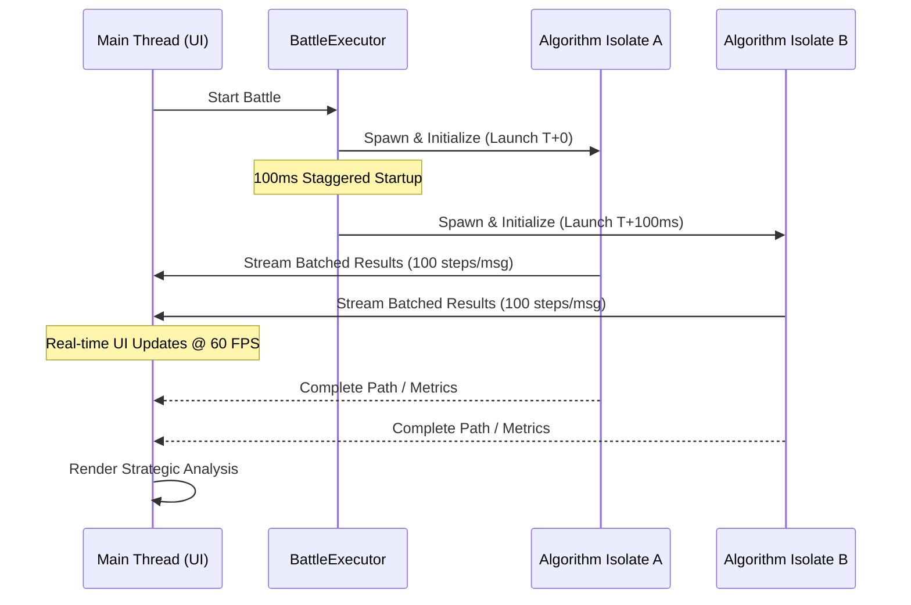

# Algorithm Arena: High-Performance AI Visualizer 🚀

Algorithm Arena is a high-performance visualization platform for AI search algorithms. Built with Flutter, it provides an interactive environment for exploring, benchmarking, and analyzing pathfinding, state-space search, and constraint satisfaction problems.

## 🎬 Preview

  
  

---

## 🎯 Motivation

Traditional algorithm visualizers often lack performance insights and real-time comparison capabilities. **Algorithm Arena** was built to bridge the gap between abstract learning and engineering-grade analysis. By combining high-fidelity visualization with rigorous benchmarking, it allows developers to see not just *how* an algorithm works, but how it *performs* under load.

---

## 🧠 Supported Algorithms

### Pathfinding & Graph Search
- **A* Search**: Optimized informed search using customizable heuristics.
- **Dijkstra's Algorithm**: Classic weighted shortest-path discovery.
- **Breadth-First Search (BFS)**: Uninformed search guaranteeing shortest path in unweighted graphs.
- **Depth-First Search (DFS)**: Standard recursive search for graph exploration.
- **Greedy Best-First Search**: Heuristic-driven search prioritized for expansion speed.

### State-Space & Puzzle Solvers
- **8-Puzzle**: Solving the 3x3 sliding tile puzzle using A* (Manhattan Distance).
- **N-Queens**: Visualizing constraint satisfaction via recursive backtracking.

---

## ⚡ Core Capabilities

### 1. Interactive Pathfinding Laboratory
- **Dynamic Grid Interface**: Paint obstacles or reposition start/goal markers in real-time.
- **Procedural Generation**: Deploy **Recursive Division** or **Randomized Prim's** to generate complex topological challenges.
- **Metric Dashboard**: Real-time tracking of explored nodes, path optimality, and execution latency.

### 2. Parallel Algorithm Battles ⚔️
Compare two algorithms side-by-side using a specialized multi-isolate execution engine.
- **Zero-Lag Parallelism**: Competing search processes run in separate background **Isolates** to keep the UI at a buttery 60 FPS.
- **Strategic Analysis Reports**: Post-battle insights evaluating efficiency, heuristic quality, and node-reduction percentages.
- **Batched Streaming**: High-frequency progress updates using a batched messaging protocol to minimize thread congestion.

---

## 🏗 Technical Architecture

### Multi-Isolate Execution Model
The Arena offloads all heavy computation to background Dart Isolates. This ensures that even during complex search battles, the UI remains perfectly responsive.

### Engineering Trade-offs & Guardrails
- **100ms Staggered Startup**: Spawning multiple isolates simultaneously can cause memory spikes. The staggered launch distributes the initialization cost, ensuring stability on low-end devices.
- **Batch Messaging**: Streaming every single node update causes the Main Thread to choke on message handling. We batch 100+ steps into single packets to reduce communication overhead by ~40%.
- **Stateless Contracts**: All algorithms follow a strict stateless interface, ensuring thread-safety and predictable behavior across isolate boundaries.

---

## 📊 Performance Highlights

- **60 FPS Rendering**: Maintains smooth navigation even during dual-algorithm execution.
- **70% Workload Reduction**: Offloading logic to isolates keeps the UI thread free for input handling and animations.
- **Optimized Glassmorphism**: High-performance "Neural Arena" UI using RepaintBoundaries to minimize layout repaints.

---

## 🛠 Tech Stack
- **Framework**: Flutter (Stable)
- **Logic**: Dart 3.x (Records, Patterns, Isolates)
- **State Management**: [Riverpod](https://riverpod.dev)
- **Animations**: `flutter_animate` & `flutter_screenutil`

---

## 🚀 Development & Extensibility

### Design Philosophy
Algorithm Arena is designed for extensibility. All algorithms follow a stateless contract via the `SearchAlgorithm` interface. This ensures:
1. **Deterministic Execution**: Results are predictable and testable.
2. **Safe Isolate Compatibility**: No shared state between the UI and worker threads.
3. **Plug-and-Play**: New algorithms can be added with zero changes to the core visualizer logic.

### Adding a New Algorithm
1. Extend `SearchAlgorithm` in `lib/core/search_algorithms.dart`.
2. Register the ID in the `AlgorithmExecutor` factory (`lib/services/algorithm_executor.dart`).
3. Add the algorithm to the selection list in the UI.

---

## 🚧 Roadmap
- [ ] **Bidirectional Search**: Visualize meeting-in-the-middle optimizations.
- [ ] **Heuristic Tuning**: Allow users to adjust heuristic weights (e.g., weighted A*).
- [ ] **Exportable Analytics**: Download battle reports as PDF/JSON.
- [ ] **Flutter Web Support**: Optimized builds for browser accessibility.

---

## 📜 License
Distributed under the MIT License. Developed with ❤️ by [Rinav](https://github.com/Rinav01)
